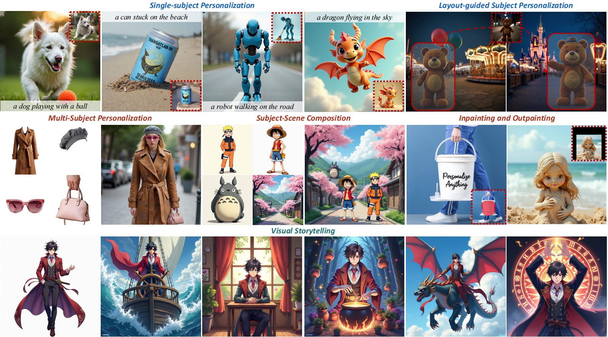
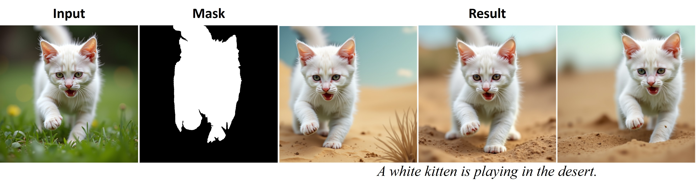

# Personalize Anything for Free with Diffusion Transformer

## 🏠 [Project Page](https://fenghora.github.io/Personalize-Anything-Page/) | [Paper](https://arxiv.org/abs/2503.12590)



*Personalize Anything* is a training-free framework for personalized image generation in Diffusion Transformers (DiT), ensuring subject consistency and structural diversity via timestep-adaptive token replacement and patch perturbation, while enabling layout control, multi-subject composition, and applications including inpainting/outpainting.

## 🌟 Features

* **Training-Free Framework:**  Achieves rapid generation through a single inversion and forward process, eliminating training or fine-tuning requirements while minimizing computational overhead.
* **High Fidelity & Controllability:** Preserves fine-grained subject details and enables generation with explicit spatial control via user-defined layouts.
* **Versatility:** Supports single/multi-subject injection, inpainting, and outpainting tasks within a unified framework.

## 🔥 Updates

* [2025-03] Release gradio demo and example code for subject reconstruction, single-subject personalization, inpainting, and outpainting.

## 🔨 Installation

Clone the repo first:

```Bash
git https://github.com/fenghora/personalize-anything.git
cd personalize-anything
```

(Optional) Create a fresh conda env:

```Bash
conda create -n person python=3.10
conda activate person
```

Install necessary packages (torch > 2):

```Bash
# pytorch (select correct CUDA version)
pip install torch torchvision --index-url https://download.pytorch.org/whl/cu118

# other dependencies
pip install -r requirements.txt
```

## 📒 Examples

* See [subject_reconstruction](./subject_reconstruction.ipynb) notebook for reconstructing subjects in different positions using [FLUX](https://huggingface.co/black-forest-labs/FLUX.1-dev). See our paper for detailed information.



* See [single_subject_personalization](./single_subject_personalization.ipynb) notebook for generating images with a subject from reference image using [FLUX](https://huggingface.co/black-forest-labs/FLUX.1-dev).


* See [inpainting_outpainting](./inpainting_outpainting.ipynb) notebook for inpainting and outpainting with mask conditions using [FLUX](https://huggingface.co/black-forest-labs/FLUX.1-dev).


## 🤗 Demos

To start a demo locally, simply run

```Bash
python gradio_demo.py
```

We currently support inpainting and outpainting in this script. We will update more features. Stay tuned!

## 💡 Tips

To run custom examples, you may need to obtain the corresponding object masks. A script for running [Grounded SAM](https://github.com/IDEA-Research/Grounded-Segment-Anything) is provided in `grounding_sam.py`. The following command will generate a segmentation mask in the same directory as the input image:

```Bash
python scripts/grounding_sam.py --image example_data/white_cat/background.png --labels cat
```

After obtaining the corresponding segmentation mask, simply modify the file paths in the configuration to effortlessly generate your subject customization.

## 🤝 Acknowledgement

We appreciate the open source of the following projects:

* [diffusers](https://github.com/huggingface/diffusers)
* [Semantic Image Inversion and Editing using Rectified Stochastic Differential Equations](https://github.com/LituRout/RF-Inversion)
* [Taming Rectified Flow for Inversion and Editing](https://github.com/wangjiangshan0725/RF-Solver-Edit)

## Citation
```
@article{feng2025personalize,
  title={Personalize Anything for Free with Diffusion Transformer},
  author={Feng, Haoran and Huang, Zehuan and Li, Lin and Lv, Hairong and Sheng, Lu},
  journal={arXiv preprint arXiv:2503.12590},
  year={2025}
}
```
